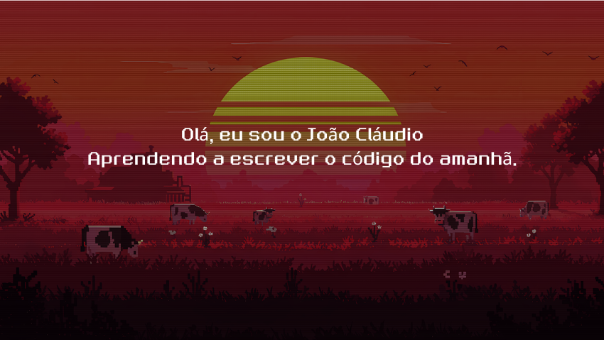

# 

 

A minha jornada começou com a descoberta da paixão por construir a web ❤️. Esse entusiasmo me impulsionou rapidamente a expandir a minha atuação para o desenvolvimento Full Stack, buscando a capacidade de criar soluções completas – da arquitetura invisível à experiência final do usuário. Com uma sólida formação técnica em TI e cursando Análise e Desenvolvimento de Sistemas, o meu objetivo é aplicar essa base de conhecimento para evoluir as minhas habilidades e encarar qualquer desafio com uma mentalidade de solução de problemas.

### Tecnologias e Ferramentas 

---

    
    
    
    
    
    
    
    
    

### Status 

---

    
    
    

